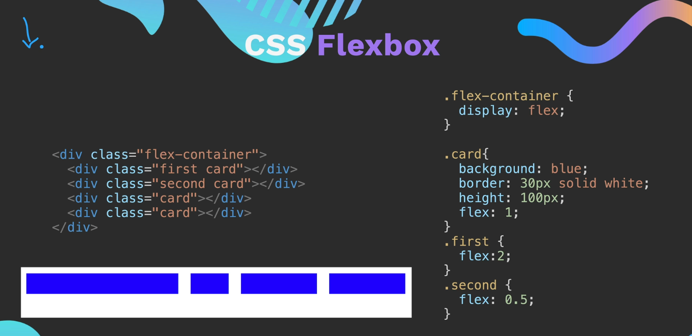
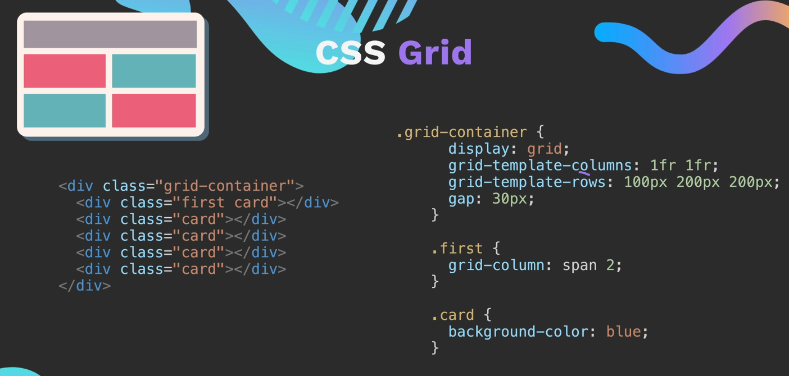

# Commands to not forget
### Start server.js in node watch mode
```bash
node --watch server.js
```
By running in watch mode, closing and restarting the server is obsolete.  
This is the (more up-to-date) alternative to the nodemon package, yet with a couple of features missing&nbsp;[[1]](https://levelup.gitconnected.com/you-might-not-need-nodemon-anymore-fbf33939adc3)

### Provide node.js (packages) autocomplection in VSCode 
```bash
npm install --save-dev @types/node
```

## Shortcut for Visual Studio Code
- Ctrl + k (switch to terminal)
- Ctrl + j (switch to editor)

# EJS with Express
## Setup 
```bash
mkdir views
touch views/<page>.ejs
```
## Importing Functions
Either the express module is then included like this
```js
const express = require("express");
```
or more "pythonic" via (requires adding ```type="module"``` to the package.json file)
```js
import express from "express";
```
Either way the express app is then initialized via
```js
const app = express();

app.set('view engine', 'ejs');

app.get("/", (req, res) => {
    var Foo = "Test";
    res.render("<page>.ejs" {foo: Foo}); 
});
```
This will send the content of var Foo to the .ejs file stored in the views folder. Inside .ejs files the variables are triggered inside ```<% %>```, e.g.,
```html
<!DOCTYPE html>
(...)
<body>
    <h1>The variable will be shown here:<%= foo %></h1>
</body>
</html>
```
In general the ```<% %>``` tags have to be put around every line of Javascript code inside the html template:
```html
    <% if (["Sunday","Saturday"].includes(currentDay)) { %>
        <h1 style="color:purple"><%=currentDay %></h1>
    <%} else { %>
        <h1 style="color:green"><%=currentDay %></h1>
    <% } %>
```
## Exporting Functions, Variables etc

Exporting functions or variables or whatever is necessary to make those available for other scripts via the import (see above).  
Export can again be done two ways. Either the "older" way with:
```js
exports.getDay = function () {...};
```
or the "newer" modular way (again with adding ```type="module"``` to the package.json file)
```js
export function getDay () {...};
```

# Web-Layout
### CSS Flexbox 


[Cheatsheet](https://css-tricks.com/snippets/css/a-guide-to-flexbox/)  
[CSS Frog Game](https://appbrewery.github.io/flexboxfroggy/)  
Works good when divs have to be ordered in **one dimension (horizontal or vertical)**.  
Some features to know: 
- flex-wrap: wrap/nowrap --> Make sure items are wrapped if they don't fit on screen. (set on parent/container)
- justify-content: flex-start/flex-end/center/space-between/space-around --> align flexbox elements along main axis. (set on parent/container)
- align-items: flex-start/.. --> align elements along the cross axis only affects the layout if height of container is set. (set on parent/containter)  

### CSS Grid 



Works good when divs have to be ordered in **two dimensions** e.g. for tables with rows and columns.  

Some features to know:
- 


### Bootstrap Framework
- Bootstrap Framework predefined CSS classes built on top of Flexbox  