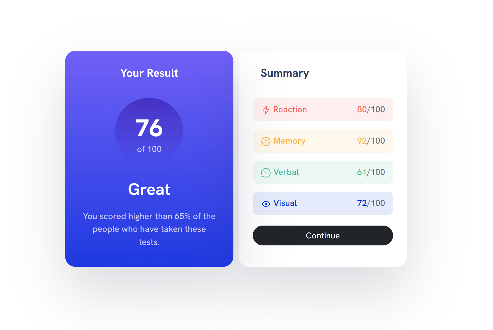
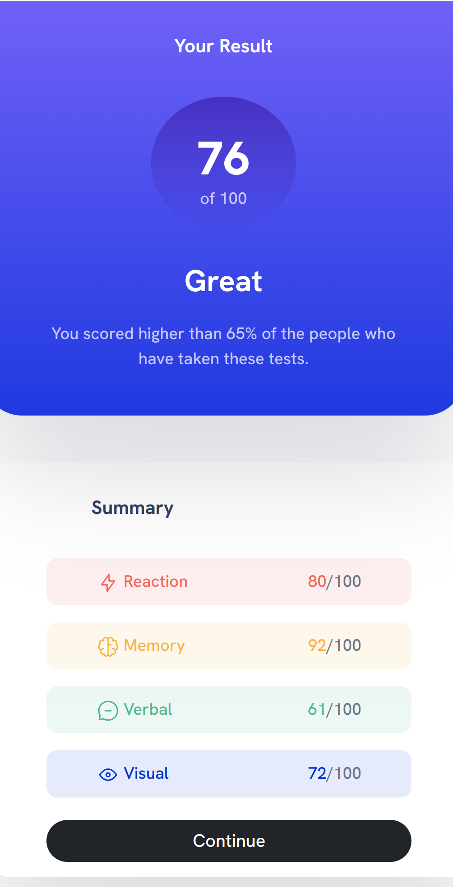

# Frontend Mentor - Results summary component solution

This is my solution to the [Results summary component challenge on Frontend Mentor](https://www.frontendmentor.io/challenges/results-summary-component-CE_K6s0maV). 

## Table of contents

- [Screenshot](#screenshot)
- [My process](#my-process)
  - [Built with](#built-with)
  - [What I learned](#what-i-learned)
  - [Continued development](#continued-development)
  - [Useful resources](#useful-resources)
- [Author](#author)

## Screenshot

### Desktop Design 



### Mobile Design




## My process

### Built with

- Semantic HTML5 markup
- CSS custom properties
- Bootstrap Rows/Cols/Buttons

### What I learned

Getting the grid layout right is the best way to start.
Hardest thing to do was, to (vertically and horizontally) center the circle inside the row element.

Structure cols depending on screen width.
```html
<div class="col-lg-3 col-md-4 col-sm-5 result-card">
```

Fine tune mobile design (which I assumed to be an arbitrary 575px).
```css
@media (max-width: 575px) {
  .result-card {
  border: 0px;
  border-radius: 35px;
  border-top-right-radius:0px;
  border-top-left-radius:0px;
  }
  .result-text {
    padding: 0% 10% 6% 10%;
  }
  .small-width-margin{
  margin-left: 40px;
  margin-right: 40px;
  }
  div.summary-card > .big-heading {
  margin-left: 80px;
  }
  .alignright {
  padding-right: 30px;
  }
  .alignleft {
  padding-left: 30px;
  }
}
```

### Continued development

I definitely need a couple more grid layout challenges to get experienced with margin, padding, rows, cols etc.
What I have not touched yet is relative positioning.

### Useful resources

- [Converting Colors](https://convertingcolors.com/) - This helped me to convert colors e.g. from HSL to HEX.  
- [General Design and Color Gradient](https://bbbootstrap.com/snippets/bootstrap-5-credit-card-template-gradient-colors-14082895) - This come quite close to the Design that is required 
- [Box-shadow examples](https://getcssscan.com/css-box-shadow-examples) - Provides a variety of different box-shadow designs

### Loose Ends

I was not able to get rid of the weird spacing inbetween the two cards in the mobile design (compare screenshot).

## Author

- Github - [Jakob Timmermann](https://github.com/JakobTimmermann/)
- Frontend Mentor - [@JakobTimmermann](https://www.frontendmentor.io/profile/JakobTimmermann)


