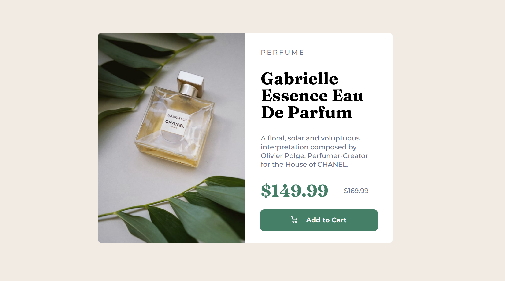
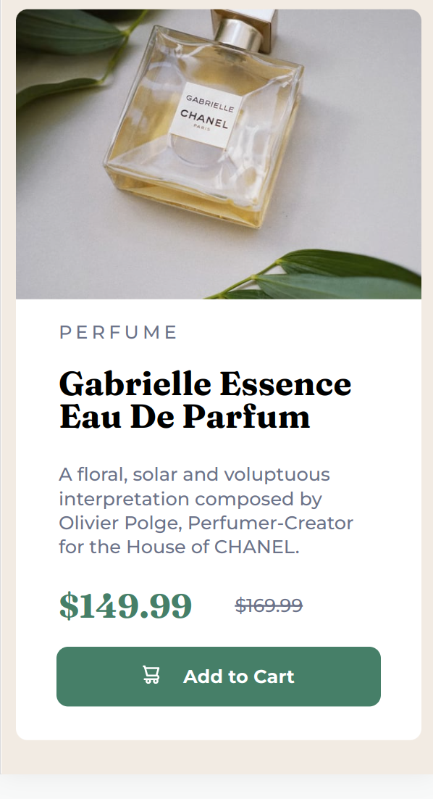

# Frontend Mentor - Product preview card component solution

This is a solution to the [Product preview card component challenge on Frontend Mentor](https://www.frontendmentor.io/challenges/product-preview-card-component-GO7UmttRfa). 

## Table of contents


- [Screenshot](#screenshot)
- [My process](#my-process)
  - [Built with](#built-with)
  - [What I learned](#what-i-learned)
  - [Continued development](#continued-development)
  - [Useful resources](#useful-resources)
- [Author](#author)

## Screenshot

### Desktop Design 



### Mobile Design




## My process

### Built with

- Semantic HTML5 markup
- CSS custom properties
- Flexbox

### What I learned

This time I started right away with the grid and used flexbox instead of bootstrap.
For this simple layout I guess this is the better option.

Work with svg structures
```html
      <button class="button-style">
        <div class="button-container">
        <svg width="15px" height="16px" xmlns="http://www.w3.org/2000/&&svg" viewBox="0 0 15 16">
          <path (...) > 
        </svg>
        Add to Cart
        </div>
      </button>
```

Include image as background
```css
    background-image: url("image-product-desktop.jpg");
    background-position: center;
    background-size: cover;
```

### Continued development

Reinforce flexbot design.  
Next challenge should include some grid layout work. And maybe I start with JS. :) 

### Useful resources

- [Scaling Scalable Vector Graphics (svg)](https://css-tricks.com/scale-svg/): "SVG looks great at any scale, but it can scale in so many different ways that getting it to behave just the way you want can be confusing for SVG beginners."

### Loose Ends

I was not able to get set the root em font size... Not a big deal but bothers me.

## Author

- Github - [Jakob Timmermann](https://github.com/JakobTimmermann/)
- Frontend Mentor - [@JakobTimmermann](https://www.frontendmentor.io/profile/JakobTimmermann)


